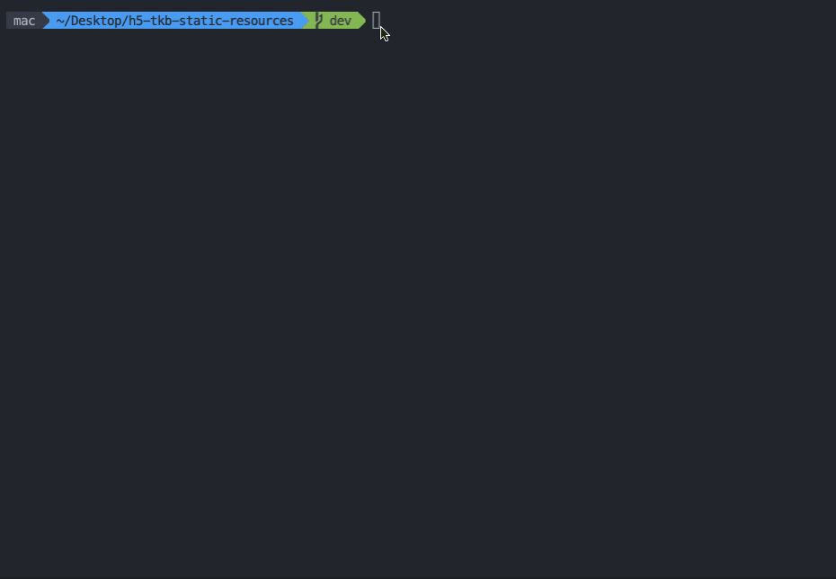

# build-cli

<p align='left'>
  <a href='https://www.npmjs.com/package/@gogogosir/build-cli'>
    
  </a>
  <a href='https://www.npmjs.com/package/@gogogosir/build-cli'>
    
  </a>
</p>

🦄 项目的打包脚本



## 背景

当使用微前端将一个庞大的项目拆分成一个个小的应用的时候，难免不了应用之间项目依赖的情况。为了解决这个问题，一般有三种方案：1、 将项目相互依赖的部分抽离一个 npm 包，每个应用安装即可；2、将被依赖项目的路径配置在 alias （例如：在 ```webpack``` 中 alias）中；3、使用 **module federation**，如果采用方案二的话，在项目打包时，就必须把本地所依赖的项目切换到目标分支并拉取最新的记录，才能执行打包命令。这无疑增加了许多工作量。

## 执行流程

- **查找所依赖的项目** 在用户的工作区查找是否存在所依赖的项目，如果不存在则会主动从远端仓库克隆下来，并为其安装好依赖
- **用户勾选打包所依赖的项目**
- **打包构建** 首先会把所依赖的项目切到目标分支并拉取最新的代码，然后执行打包命令，如果是构建测试环境的包，在打包成功后会创建一个 **test-projectName** 的分支和一个 **projectName.zip** 的压缩包。如果是构建预发布环境的包，在打包成功后会创建一个 **staging** 的分支和一个 **projectName.zip** 的压缩包。
- **释放被 stash 的记录** 如果所依赖的项目的 git 工作区是不干净的，则会先 stash 掉，然后在切换分支，当脚本执行完打包脚本后，会自动把所依赖的项目切回之前的分支，并释放被 stash 的记录

## node 版本

node 版本需大于等于 ```v14.16.0```

## 安装

```shell
// npm
npm install @gogogosir/build-cli -D

// yarn
yarn add @gogogosir/build-cli -D
```

## 使用

- **在根目录下新建一个 ```.build-cli.cjs``` 文件：**

```js
const pkg = require('./package.json')

module.exports = {
  projectName: pkg.name,
  distName: 'dist', // 这个配置根据你项目打包后的目录名而定的
  targetBranch: { // key 表示要构建的分支名，value 表示选择该分支时打包的命令
    staging: 'npm run build' // staging 表示对应的目标分支名，其对应的 value 代表选择该分支构建时要运行的构建命令
  },
  // 以下参数是非必传
  dependencies: [
    // {
    //   remoteUrl: '请填写项目的git地址',
    //   defaultBranch: 'master',
    //   packageManager: 'yarn', // 可选，包管理器
    //   installCommand: ['npm link xxx'] // 可选，install后额外执行的命令
    // }
  ],
  dependenciesWorkspace: 'BUILD_CLI_WORKSPACE' // 定义工作区的路径地址
}
```

- **在 ```package.json``` 中添加以下配置：**

```json
"scripts": {
  "build": "build-cli"
}
```
 **如果 dependencies 有值，您还需配置  dependenciesWorkspace 所绑定的 node 环境的变量**

- **在根目录新增 ```.env.workspace``` 文件**

绝对路径的配置方式的用例:

```
BUILD_CLI_WORKSPACE="/Users/mac/Desktop"
```

相对路径的配置方式的用例:

相对于 ```process.cwd()```的路径

```
BUILD_CLI_WORKSPACE=".."
```

- **配置 ```package.json```**

```json
"scripts": {
  "build": "build-cli -e workspace"
}
```

## 参数配置

### projectName

- **Type:** `string`
- **Required:** `true`

项目名称

### distName

- **Type:** `string`
- **Required:** `true`

打包后的目录名

### targetBranch

- **Type:** `Record<string, string>`
- **Required:** `true`
- **Default** `{}`

打包时对应的目标分支和其构建命令的映射

例如：
```json
{
  "targetBranch": {
    "staging": "npm run build" // staging 表示对应的目标分支名，其对应的 value 代表选择该分支构建时要运行的构建命令
  }
}
```

效果：


<br/>

### dependenciesWorkspace

- **Type:** `string`
- **Required:** `false`
- **Default** `BUILD_CLI_WORKSPACE`

一个 node 的全局变量名，用户存放所依赖项目的工作区地址

### dependencies

- **Type:** `{remoteUrl, defaultBranch, packageManager, installCommand}[]`
- **Required:** `false`
- **Default** `[]`

所依赖的项目的一些配置

用例:

```json
{
  "dependencies": [{
    "remoteUrl": "xxxx",
    "defaultBranch": "master",
    "packageManager": "yarn",
    "installCommand": ["npm link xxx"]
  }]
}
```

#### remoteUrl

- **Type:** `string`
- **Required:** `true`
- **Default** `''`

git 仓库地址

#### defaultBranch

- **Type:** `string`
- **Required:** `false`
- **Default** `''`

默认选中的分支名

#### packageManager

- **Type:** `string`
- **Required:** `false`
- **Default** `''`

在安装依赖时的包管理器，如果用户不传入该值，则优先使用 yarn, 如果用户没有安装 yarn 则使用 npm

#### installCommand

- **Type:** `Array<string>`
- **Required:** `false`
- **Default** `[]`

在执行完 install 后，运行的其他命令，例如用例中的 npm link xxx

## Q&A

- **因为 node 版本的原因，在项目安装依赖时报错**

这个就必须由用户自己切换至合适的 node 版本，手动 install 依赖

- **为什么 **dependenciesWorkspace** 所绑定的是 node 的环境变量名**

为了减少团队成员因为存放项目的目录地址的不同而造成不必要的冲突。

- **如何自定义配置文件的路径**

```json
"scripts": {
  "build": "build-cli -c scripts/xxx.cjs"
}
```

