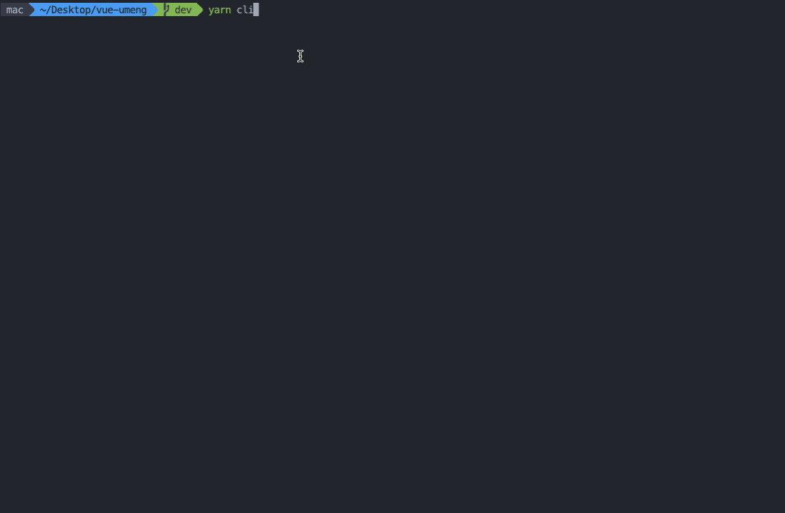

# build-cli

<p align='left'>
  <a href='https://www.npmjs.com/package/build-cli'>
    
  </a>
  <a href='https://www.npmjs.com/package/build-cli'>
    
  </a>
</p>

🦄 项目的打包脚本



## 背景

当使用微前端将一个庞大的项目拆分成一个个小的应用的时候，难免不了应用之间项目依赖的情况。为了解决这个问题，一般有两种方案：1、 将项目相互依赖的部分抽离一个 npm 包，每个应用安装即可；2、将被依赖项目的路径配置在 alias （例如：在 ```webpack``` 中 alias）中；如果采用方案二的话，在项目打包时，就必须把本地所依赖的项目切换到目标分支并拉取最新的记录，才能执行打包命令。这无疑增加了许多工作量。为了解决这个痛点，**build-cli** 孕育而生。

## 执行流程

- **查找所依赖的项目** 在用户的工作区查找是否存在所依赖的项目，如果不存在则会主动从远端仓库克隆下来，并为其安装好依赖
- **用户勾选打包配置** 让用户自定义其打包的配置项
- **构建打包** 首先会把所依赖的项目切到目标分支并拉取最新的代码，然后执行打包命令，如果是构建测试环境的包，在打包成功后会创建一个 **test-projectName** 的分支和一个 **projectName.zip** 的压缩包。如果是构建预发布环境的包，在打包成功后会创建一个 **staging** 的分支和一个 **projectName.zip** 的压缩包。
- **释放被 stash 的记录** 如果所依赖的项目的 git 工作区是不干净的，则会先 stash 掉，然后在切换分支，当脚本执行完打包脚本后，会自动把所依赖的项目切回之前的分支，并释放被 stash 的记录

## 安装

```bash
// npm
npm install build-cli -D

// yarn
yarn add build-cli -D
```

## 使用

- 在根目录下新建一个 ```.build-cli.js``` 文件：

```js
const pkg = require('./package.json')

module.exports = {
  projectName: pkg.name,
  distName: 'dist', // 这个配置根据你项目的webpack的output而定
  dependencies: [{
    remoteUrl: '请填写项目的git地址',
    defaultBranch: 'master'
  }],
  buildCommand: {
    test: 'xxxxx', // 打包测试环境的命令
    staging: 'xxx' // 打包预发布环境的命令
  }
}
```

- 在 ```package.json``` 中添加以下配置：

```
"scripts": {
  "build": "build-cli"
}
```

- 配置 dependenciesWorkspace 所绑定的 node 环境的变量

方式一：


找到 ```.zshrc``` 文件并配置：

用例：将BUILD_CLI_WORKSPACE指定为Desktop

```
export BUILD_CLI_WORKSPACE=Desktop
```

方式二：

1. 安装 ```dotenv-cli```

```dash
// npm
npm install dotenv-cli -D

// yarn
yarn add dotenv-cli -D
```

2. 在根目录新增 ```.env.workspace```

```
BUILD_CLI_WORKSPACE=Desktop
```

3. 配置 ```.gitignore```

```
.env.workspace
```
4. 配置 ```package.json```
```json
"scripts": {
  "build": "dotenv -e .env.workspace build-cli"
}
```

## 参数配置

**projectName**
类型：```String```
是否必填: ```true```

项目名称

**distName**
类型：```String```
是否必填: ```true```

打包后的目录名

**dependenciesWorkspace**
类型：```String```
是否必填: ```false```
默认值： ```BUILD_CLI_WORKSPACE```

一个 node 的全局变量名，用户存放所依赖项目的工作区地址

**dependencies**
类型：```Array<DepType>```
是否必填: ```false```
默认值： ```[]```

所依赖的项目的一些配置

用例:

```json
{
  dependencies: [{
    remoteUrl: 'xxxx',
    defaultBranch: 'master',
    packageManager: 'yarn',
    installCommand: ['npm link xxx']
  }]
}
```
DepType 类型说明：

remoteUrl
类型：```String```
是否必填: ```true```
默认值： ```''```

git 仓库地址

defaultBranch
类型：```String```
是否必填: ```false```
默认值： ```''```

默认选中的分支名

git 仓库地址

packageManager
类型：```String```
是否必填: ```false```
默认值： ```''```

在安装依赖时的包管理器，如果用户不传入该值，则优先使用 yarn, 如果用户没有安装 yarn 则使用 npm

installCommand
类型：```Array<string>```
是否必填: ```false```
默认值： ```[]```

在执行完 install 后，运行的其他命令，例如用例中的 npm link xxx

**buildCommand**
类型：```Array<CommandType>```
是否必填: ```false```
默认值： ```[{ test: 'npm run build:test', staging: 'npm run build:prod'}]```

打包命令的配置

CommandType 属性说明

test
类型：```String```
是否必填: ```true```
默认值： ```npm run build:test```

打包测试环境的命令行

staging
类型：```String```
是否必填: ```true```
默认值： ```npm run build:prod```

打包预发布环境的命令行

## Q&A

1. 因为 node 版本的原因，在项目安装依赖时报错

这个就必须由用户自己切换至合适的 node 版本，手动 install 依赖

2. 为什么 **dependenciesWorkspace** 所绑定的是 node 的环境变量名

为了减少团队成员因为存放项目的目录地址的不同而造成不必要的冲突。

3. 如何自定义配置文件的路径

```
"scripts": {
  "build": "build-cli -c scripts/xxx.js"
}
```
